# Microsoft Sentinel SOC Lab

## Overview

This project documents the deployment and investigation workflow of a small SOC lab built with Microsoft Sentinel, Azure Log Analytics, and Windows Security Events. A Windows Server domain controller (`DC01.corp.cyberlab.test`) was connected to Azure logging so that authentication and security activity could be queried with Kusto Query Language (KQL).

The lab culminates in an investigation of Windows Event ID **4625 (An account failed to log on)** and a KQL query that groups repeated failed authentication attempts by account and source IP.

## Objectives

- Deploy an Azure Log Analytics workspace.
- Onboard the workspace to Microsoft Sentinel.
- Enable Windows Security Events collection.
- Verify that events from the domain controller are reaching Log Analytics.
- Use KQL to inspect Windows security event activity.
- Investigate failed authentication events (Event ID 4625).
- Create a simple detection query for repeated failed logons.

## Lab Environment

| Component | Purpose |
| --- | --- |
| Microsoft Azure | Cloud platform hosting the monitoring resources |
| Microsoft Sentinel | SIEM used for security monitoring and investigation |
| Azure Log Analytics | Central log storage and KQL query environment |
| Windows Server / DC01 | Domain controller and Windows Security Event source |
| Windows Security Events | Authentication and security telemetry |
| KQL | Log analysis and detection queries |

## Investigation Workflow

### 1. Create the Log Analytics workspace

A Log Analytics workspace named `law-sentinel-lab` was created in the `RG-SecurityLab` resource group in the Southeast Asia region.

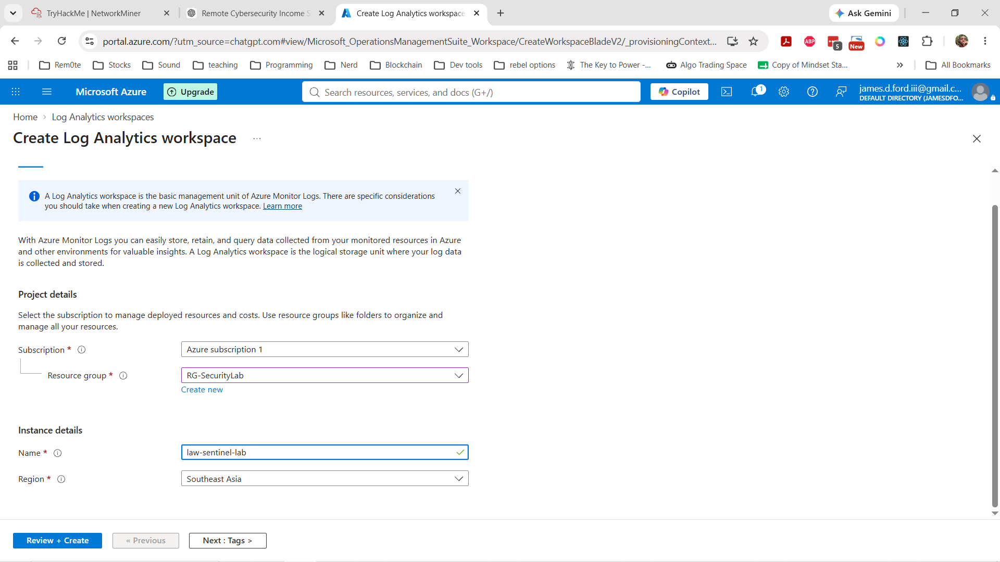

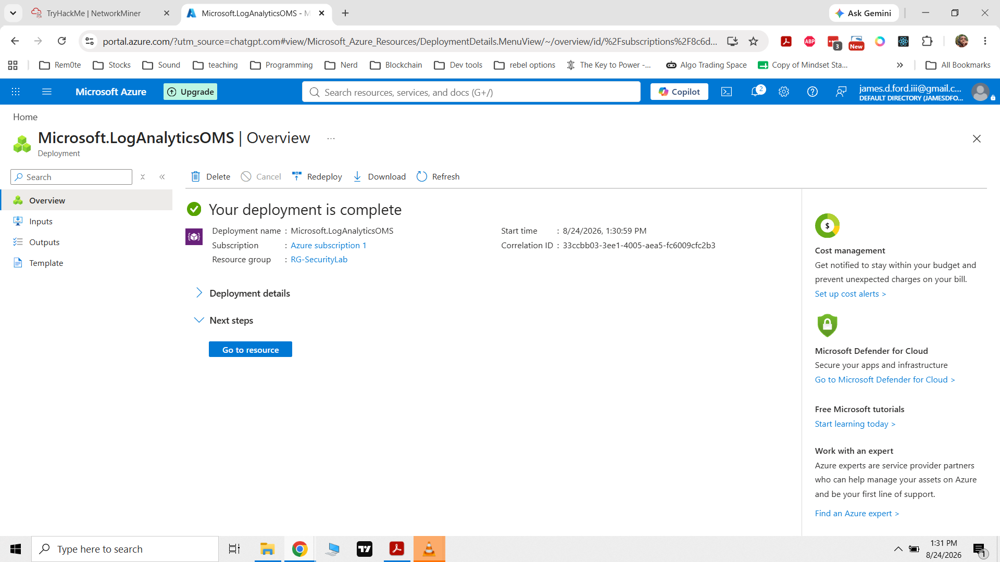

### 2. Verify the workspace

After deployment, the workspace was confirmed active and ready to receive telemetry.

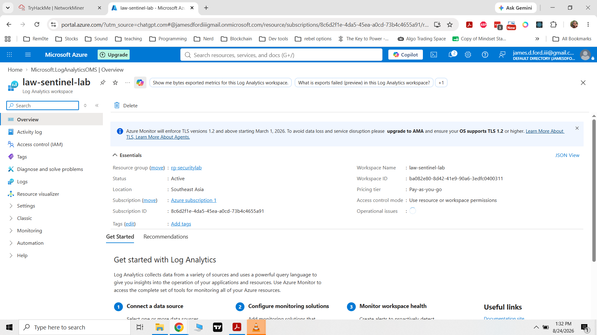

### 3. Onboard Microsoft Sentinel

Microsoft Sentinel initially had no workspace configured. The `law-sentinel-lab` Log Analytics workspace was selected and onboarded to Sentinel.

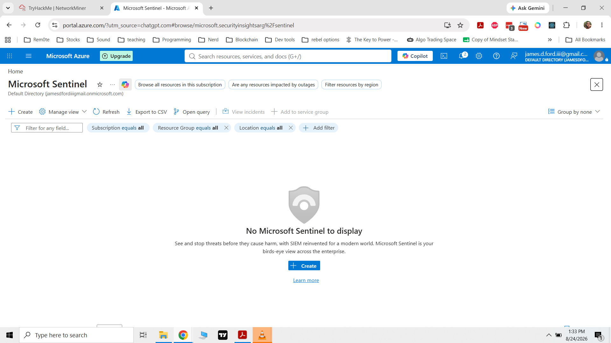

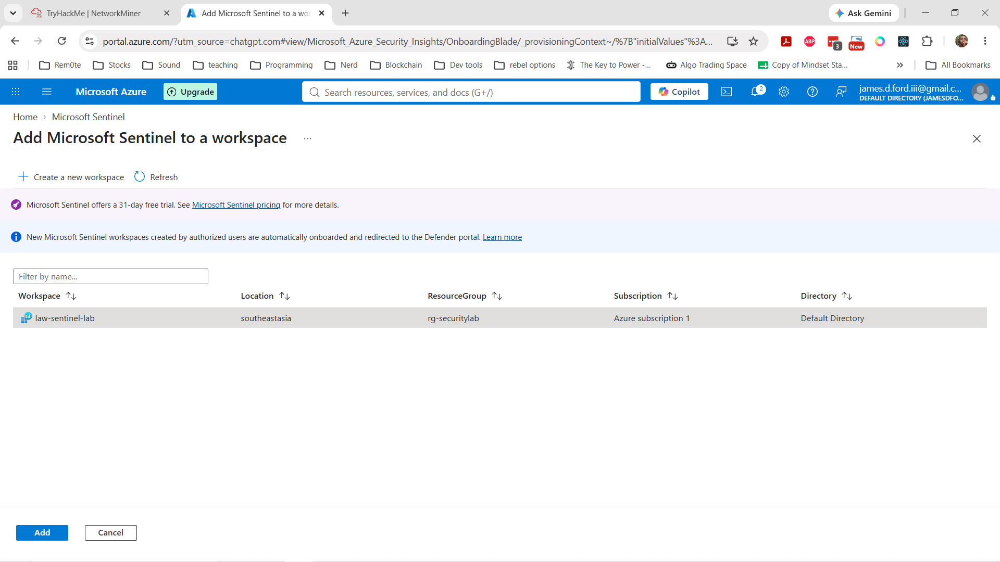

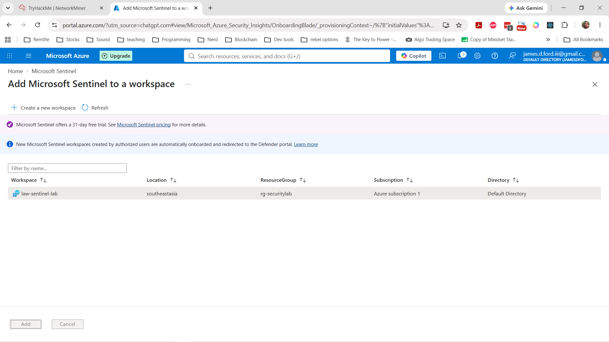

### 4. Enable Windows Security Events

The Windows Security Events solution was installed so that Windows authentication and security telemetry could be analyzed in the SIEM environment.

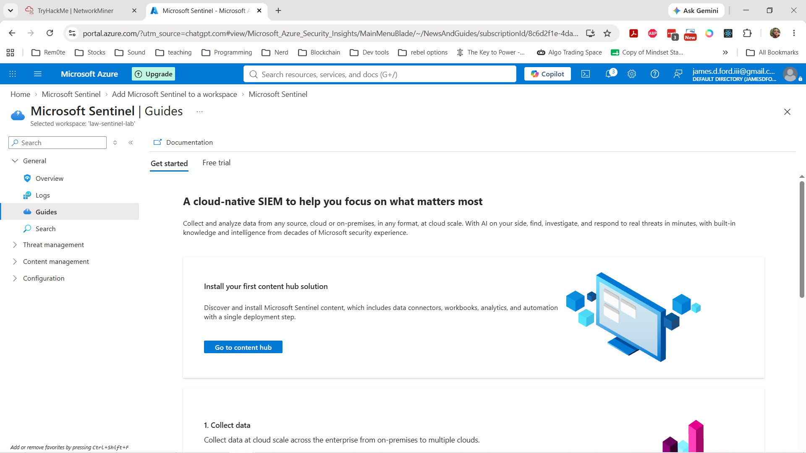

### 5. Verify log ingestion

Log Analytics was queried to verify that the `SecurityEvent` table was receiving Windows security logs. The results confirmed SecurityEvent telemetry and heartbeat data were reaching the workspace.

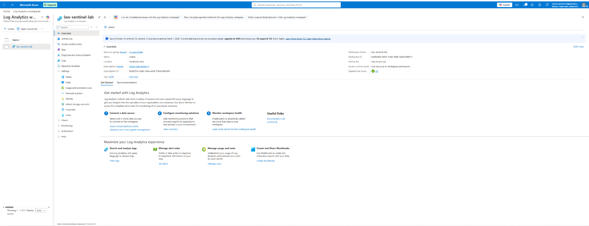

A host-specific query then confirmed that events were being received from the domain controller:

```kusto
SecurityEvent
| where TimeGenerated > ago(3h)
| summarize Events=count() by Computer
| order by Events desc
```

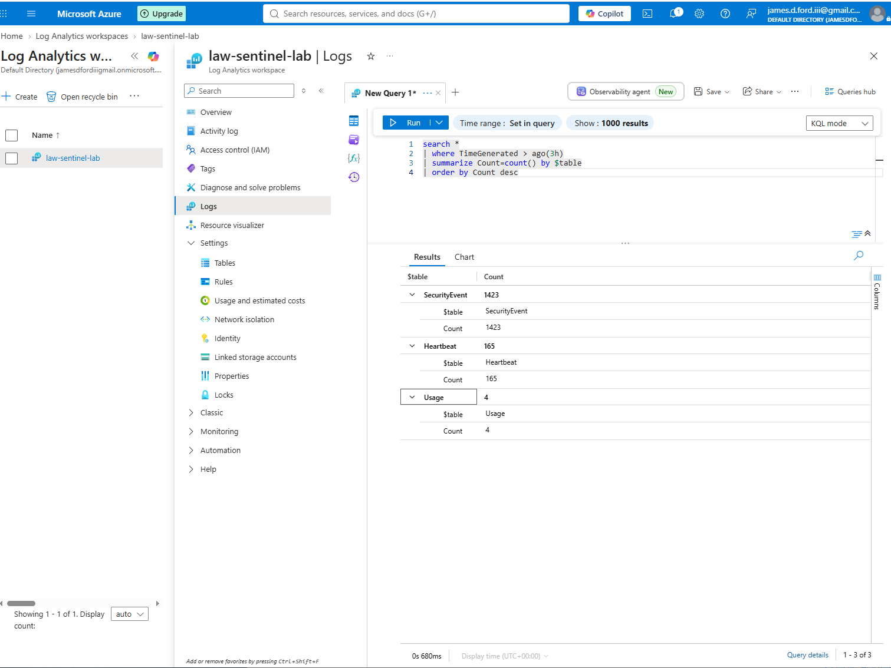

### 6. Analyze security events by Event ID

The next query grouped DC01 security telemetry by Windows Event ID and activity description:

```kusto
SecurityEvent
| where Computer == "DC01.corp.cyberlab.test"
| where TimeGenerated > ago(3h)
| summarize Count=count() by EventID, Activity
| order by Count desc
```

The results included common Windows authentication and privilege events such as:

- **4624** — An account was successfully logged on.
- **4672** — Special privileges assigned to new logon.
- **4634** — An account was logged off.
- **4769** — A Kerberos service ticket was requested.
- **4648** — A logon was attempted using explicit credentials.
- **4768** — A Kerberos authentication ticket (TGT) was requested.

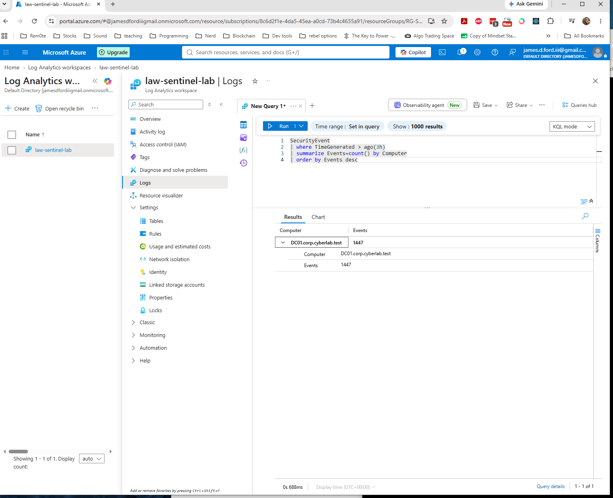

### 7. Investigate failed logons — Event ID 4625

Failed authentication activity was isolated with Event ID 4625:

```kusto
SecurityEvent
| where Computer == "DC01.corp.cyberlab.test"
| where EventID == 4625
| project TimeGenerated, Account, IpAddress, LogonType, FailureReason, Activity
| order by TimeGenerated desc
```

The query returned multiple failed authentication events associated with the lab administrator account. This demonstrated that authentication failures generated on the Windows environment were successfully ingested and could be investigated centrally in Log Analytics/Sentinel.

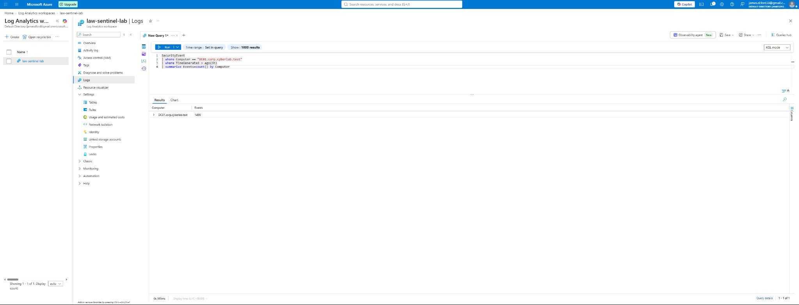

### 8. Detect repeated failed authentication attempts

The investigation was converted into a simple detection-style query by grouping failures by account and IP address:

```kusto
SecurityEvent
| where Computer == "DC01.corp.cyberlab.test"
| where EventID == 4625
| where TimeGenerated > ago(1h)
| summarize FailedLogons=count(),
            FirstAttempt=min(TimeGenerated),
            LastAttempt=max(TimeGenerated)
            by Account, IpAddress
| where FailedLogons >= 3
| order by FailedLogons desc
```

This query identifies accounts generating three or more failed logons during the selected one-hour window and records the first and last observed attempts.

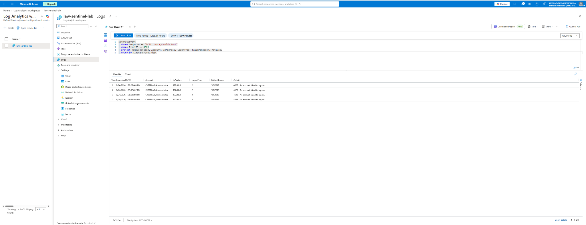

## Findings

The lab demonstrated an end-to-end SIEM workflow: Windows Security Events were generated on a domain controller, collected into Azure Log Analytics, and analyzed with KQL. Authentication activity could be separated by Event ID, and failed logons could be aggregated into a detection condition suitable as the basis for further alerting or investigation.

The failed-logon events in this project were intentionally generated in a controlled lab environment. They do not represent evidence of a real intrusion.

## Skills Demonstrated

- Microsoft Sentinel deployment and onboarding
- Azure Log Analytics configuration
- Windows Security Event collection
- SIEM log ingestion validation
- Kusto Query Language (KQL)
- Windows Event ID analysis
- Authentication log investigation
- Failed-logon detection logic
- Basic SOC investigation workflow

## Key Takeaway

The project moved beyond simply deploying a SIEM. It demonstrated the full path from **telemetry collection → ingestion verification → log querying → authentication investigation → detection logic**, providing hands-on experience with the same core workflow used in security operations environments.

## Screenshots

Additional implementation evidence is available in the [`screenshots`](screenshots/) directory.
